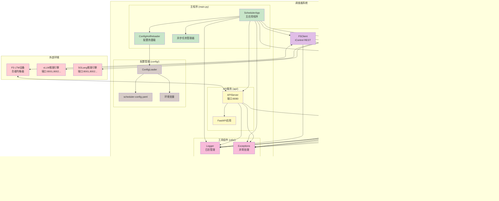

# F5 LLM Inference Gateway 调度器 - 模块关系图

## 系统架构概览

```
┌─────────────────────────────────────────────────────────────────────────────────────┐
│                            F5 LLM Inference Gateway 调度器                           │
├─────────────────────────────────────────────────────────────────────────────────────┤
│                                                                                     │
│  ┌─────────────┐    ┌──────────────────────────────────────────────────────────┐    │
│  │   外部用户   │────┤                 HTTP API 层                               │    │
│  │  (F5 设备)  │    │  ┌─────────────────┐  ┌─────────────────────────────────┐ │    │
│  └─────────────┘    │  │  POST /select   │  │  GET /pools/status             │ │    │
│                     │  │  GET /health    │  │  POST /simulate                │ │    │
│                     │  └─────────────────┘  └────────────────────────────────┘ │    │
│                     └──────────────────────────────────────────────────────────┘    │
│                                          │                                          │
│  ┌─────────────────────────────────────────────────────────────────────────────────┐│
│  │                              应用协调层 (main.py)                                 ││
│  │  ┌──────────────────┐  ┌──────────────────┐  ┌──────────────────────────────┐   ││
│  │  │  配置热重载器      │  │  任务调度器        │  │  信号处理器                   │   ││
│  │  │  (ConfigReloader)│  │ (Task Scheduler) │  │ (Signal Handler)             │   ││
│  │  └──────────────────┘  └──────────────────┘  └──────────────────────────────┘   ││
│  └─────────────────────────────────────────────────────────────────────────────────┘│
│                                          │                                          │
│  ┌─────────────────────────────────────────────────────────────────────────────────┐│
│  │                                核心业务层                                         ││
│  │  ┌──────────────┐  ┌──────────────┐  ┌──────────────┐  ┌─────────────────────┐  ││
│  │  │   F5客户端    │  │  指标收集器    │  │  分数计算器    │ │     调度器           │  ││
│  │  │ (F5Client)   │  │(MetricsCollect│ │(ScoreCalc)   │  │  (Scheduler)        │  ││
│  │  └──────────────┘  │              │  └──────────────┘  │  ┌─────────────────┐│  ││
│  │                    │              │                    │  │  加权随机选择器   ││  ││
│  │                    └──────────────┘                    │  │ (WeightedRandom)││  ││
│  │                                                        │  └─────────────────┘│  ││
│  │                                                        └─────────────────────┘  ││
│  └─────────────────────────────────────────────────────────────────────────────────┘│
│                                          │                                          │
│  ┌─────────────────────────────────────────────────────────────────────────────────┐│
│  │                               数据模型层                                          ││
│  │  ┌──────────────┐  ┌──────────────┐  ┌──────────────┐  ┌─────────────────────┐  ││
│  │  │   Pool       │  │ PoolMember   │  │  EngineType  │  │     POOLS全局存储    │  ││
│  │  │   (Pool)     │  │ (成员对象)    │  │  (引擎类型)    │  │   (Dict[str,Pool])  │  ││
│  │  └──────────────┘  └──────────────┘  └──────────────┘  └─────────────────────┘  ││
│  └─────────────────────────────────────────────────────────────────────────────────┘│
│                                          │                                          │
│  ┌─────────────────────────────────────────────────────────────────────────────────┐│
│  │                              配置管理层                                           ││
│  │  ┌──────────────┐  ┌──────────────┐  ┌──────────────┐  ┌─────────────────────┐  ││
│  │  │ 配置加载器     │  │  配置数据模型  │  │  配置文件     │  │    环境变量处理       │  ││
│  │  │(ConfigLoader)│  │ (AppConfig)  │  │ (YAML文件)    │  │  (Environment)      │  ││
│  │  └──────────────┘  └──────────────┘  └──────────────┘  └─────────────────────┘  ││
│  └─────────────────────────────────────────────────────────────────────────────────┘│
│                                          │                                          │
│  ┌─────────────────────────────────────────────────────────────────────────────────┐│
│  │                               工具支撑层                                          ││
│  │  ┌──────────────┐  ┌──────────────┐  ┌──────────────┐  ┌─────────────────────┐  ││
│  │  │   日志管理    │  │   异常处理    │  │   类型定义    │  │     工具函数          │  ││
│  │  │  (Logger)    │  │ (Exceptions) │  │  (TypeDefs)  │  │    (Utilities)      │  ││
│  │  └──────────────┘  └──────────────┘  └──────────────┘  └─────────────────────┘  ││
│  └─────────────────────────────────────────────────────────────────────────────────┘│
│                                                                                     │
└─────────────────────────────────────────────────────────────────────────────────────┘
```

# Mermaid 格式图表

## 1. 系统架构分层图


## 2. 数据流程图


## 3. 模块交互时序图


## 4. 核心业务模块关系图


## 5. 完整的系统部署架构图



## Mermaid图说明

1. **系统架构分层图**: 展示了完整的分层架构和模块依赖关系
2. **数据流程图**: 显示了数据在系统中的流转路径和处理过程
3. **模块交互时序图**: 描述了请求处理的时序和后台任务的执行流程
4. **核心业务模块关系图**: 详细展示了核心模块间的关系和数据流向
5. **完整的系统部署架构图**: 包含外部环境和内部架构的完整部署视图

## 详细模块关系与接口

### 1. 主程序模块 (main.py)

**职责**: 应用程序协调器和任务调度器

**关键类**:
- `SchedulerApp`: 主应用类
- `ConfigHotReloader`: 配置热重载器

**主要接口**:
```python
class SchedulerApp:
    async def initialize()           # 初始化所有组件
    async def start()               # 启动应用程序
    async def stop()                # 停止应用程序
    async def apply_config_changes() # 应用配置变更
```

**依赖关系**:
- 依赖 `config` 模块进行配置管理
- 依赖 `core` 模块的所有业务组件
- 依赖 `api` 模块提供HTTP服务
- 依赖 `utils` 模块进行日志和异常处理

### 2. 配置管理模块 (config/)

**职责**: 配置文件读取、解析、验证和热重载

**关键类**:
- `ConfigLoader`: 配置加载器
- `AppConfig`: 应用配置数据模型
- `GlobalConfig`: 全局配置
- `F5Config`: F5连接配置
- `SchedulerConfig`: 调度器配置
- `PoolConfig`: Pool配置
- `MetricsConfig`: 指标配置

**主要接口**:
```python
def load_config(config_file: str) -> AppConfig
def get_config_loader() -> ConfigLoader

class AppConfig:
    global_config: GlobalConfig    # 全局配置
    f5: F5Config                  # F5配置
    scheduler: SchedulerConfig     # 调度器配置
    pools: List[PoolConfig]       # Pool配置列表
    modes: List[ModeConfig]       # 算法模式配置
```

**被依赖关系**:
- 被 `main.py` 调用进行配置加载
- 被所有业务模块使用配置信息

### 3. 核心业务模块 (core/)

#### 3.1 数据模型 (core/models.py)

**职责**: 定义核心数据结构和全局存储

**关键类**:
- `Pool`: Pool对象，包含成员列表
- `PoolMember`: Pool成员对象，包含指标和分数
- `EngineType`: 推理引擎类型枚举
- `POOLS`: 全局Pool存储字典

**主要接口**:
```python
class Pool:
    def update_members_smartly()   # 智能更新成员列表
    def get_pool_key()            # 获取Pool唯一标识
    def find_member()             # 查找指定成员

class PoolMember:
    def metric_uri()              # 生成指标URI

# 全局函数
def get_pool_by_key(pool_name: str, partition: str) -> Pool
def add_or_update_pool(pool: Pool)
def get_all_pools() -> List[Pool]
```

#### 3.2 F5客户端 (core/f5_client.py)

**职责**: F5 LTM iControl REST API交互

**关键类**:
- `F5Client`: F5 API客户端
- `F5Token`: F5 Token信息数据类

**主要接口**:
```python
class F5Client:
    def __init__(host, port, username, password)    # 初始化客户端
    async def __aenter__()                          # 异步上下文管理器入口
    async def __aexit__()                           # 异步上下文管理器出口
    async def login() -> F5Token                    # 登录F5获取Token
    async def delete_token(token: F5Token) -> bool  # 删除F5上的Token
    async def validate_token(token: F5Token) -> bool # 验证Token是否有效
    async def ensure_valid_token() -> F5Token       # 确保有效Token
    async def get_pool_members(pool_name, partition) -> List[PoolMember]  # 获取Pool成员列表
    async def close()                               # 关闭客户端
    async def _ensure_session()                     # 确保会话已创建
    async def _extend_token_timeout(token) -> bool  # 延长Token超时时间

@dataclass
class F5Token:
    token: str              # Token字符串
    name: str               # Token名称
    expiration_time: float  # 过期时间
    timeout: int = 36000    # 超时时间（秒）
```

**依赖关系**:
- 依赖 `models` 中的PoolMember类
- 依赖 `utils.exceptions` 中的F5ApiError和TokenAuthenticationError类
- 被 `main.py` 调用进行Pool成员获取

#### 3.3 指标收集器 (core/metrics_collector.py)

**职责**: 从推理引擎收集性能指标

**关键类**:
- `MetricsCollector`: 指标收集器

**主要接口**:
```python
class MetricsCollector:
    async def collect_pool_metrics()    # 收集Pool指标
    async def collect_member_metrics()  # 收集成员指标
    def _parse_prometheus_metrics()     # 解析Prometheus格式指标
```

**依赖关系**:
- 依赖 `models` 中的Pool和PoolMember类
- 依赖 `models` 中的ENGINE_METRICS配置
- 被 `main.py` 调用进行指标收集

#### 3.4 分数计算器 (core/score_calculator.py)

**职责**: 基于指标计算成员分数

**关键类**:
- `ScoreCalculator`: 分数计算器

**主要接口**:
```python
class ScoreCalculator:
    def calculate_pool_scores()      # 计算Pool所有成员分数
    def calculate_member_score()     # 计算单个成员分数
    def _s1_algorithm()             # S1算法实现
```

**依赖关系**:
- 依赖 `models` 中的Pool和PoolMember类
- 依赖配置中的算法参数
- 被 `main.py` 和 `scheduler.py` 调用

#### 3.5 调度器 (core/scheduler.py)

**职责**: 最优成员选择和加权随机算法

**关键类**:
- `Scheduler`: 调度器主类
- `WeightedRandomSelector`: 加权随机选择器

**主要接口**:
```python
class Scheduler:
    async def select_optimal_member()  # 选择最优成员
    def get_pool_status()             # 获取Pool状态
    async def simulate_selection()     # 模拟选择过程

class WeightedRandomSelector:
    def select()                      # 加权随机选择
    def _weighted_random_choice()     # 加权随机算法实现
```

**依赖关系**:
- 依赖 `models` 中的所有数据结构
- 被 `api` 模块调用提供调度服务

### 4. API服务模块 (api/)

**职责**: 提供HTTP RESTful API接口

**关键类**:
- `APIServer`: API服务器
- `ScheduleRequest`: 调度请求模型
- `ScheduleResponse`: 调度响应模型

**主要接口**:
```python
# HTTP接口
POST /scheduler/select                        # 选择最优成员
GET /pools/{pool_name}/{partition}/status     # 获取单个Pool状态
GET /pools/status                            # 获取所有Pool状态
GET /health                                  # 健康检查
POST /pools/{pool_name}/{partition}/simulate  # 模拟选择过程（测试接口）
POST /pools/{pool_name}/{partition}/analyze   # 高级概率分析（测试接口）
```

**依赖关系**:
- 依赖 `core/scheduler.py` 进行调度处理
- 被外部客户端调用

### 5. 工具支撑模块 (utils/)

#### 5.1 日志管理 (utils/logger.py)

**职责**: 统一日志管理

**关键类**:
- `SchedulerLogger`: 日志管理器

**主要接口**:
```python
def init_logger(debug: bool, log_file: str, log_level: str) -> logging.Logger
def get_logger() -> logging.Logger
```

#### 5.2 异常处理 (utils/exceptions.py)

**职责**: 自定义异常类定义

**关键类**:
```python
class SchedulerException          # 基础异常
class ConfigurationError          # 配置错误
class F5ApiError                 # F5 API错误
class MetricsCollectionError     # 指标收集错误
class ScoreCalculationError      # 分数计算错误
class SchedulingError            # 调度错误
```

## 数据流图

```
┌─────────────┐    ┌──────────────┐    ┌─────────────────┐    ┌──────────────┐
│  配置文件    │───▶│  配置加载器    │───▶│   应用初始化      │───▶│   任务启动    │
│ (YAML)      │    │(ConfigLoader)│    │ (SchedulerApp)  │    │ (Tasks)      │
└─────────────┘    └──────────────┘    └─────────────────┘    └──────────────┘
                                                                      │
┌─────────────┐    ┌──────────────┐    ┌─────────────────┐           │
│   F5 LTM    │◀───│  F5客户端     │◀───│  Pool获取任务    │◀──────────┘
│   (设备)     │    │ (F5Client)   │    │ (Pool Fetch)    │
└─────────────┘    └──────────────┘    └─────────────────┘
                                                │
                                                ▼
┌─────────────┐    ┌──────────────┐    ┌─────────────────┐
│  推理引擎    │◀───│  指标收集器    │◀───│  指标收集任务     │
│ (vLLM/SGL) │    │(MetricsCollect│    │(Metrics Fetch)  │
└─────────────┘    └──────────────┘    └─────────────────┘
                                                │
                                                ▼
┌─────────────┐    ┌──────────────┐    ┌─────────────────┐
│  POOLS      │◀───│  分数计算器    │◀───│  分数计算任务     │
│ (全局存储)   │    │(ScoreCalc)    │    │(Score Calc)     │
└─────────────┘    └──────────────┘    └─────────────────┘
       │
       ▼
┌─────────────┐    ┌──────────────┐    ┌─────────────────┐
│   调度器     │───▶│   API服务器   │◀───│   外部请求       │
│ (Scheduler) │    │ (APIServer)  │    │ (F5 Device)     │
└─────────────┘    └──────────────┘    └─────────────────┘
```

## 关键接口说明

### 1. 配置接口
- **输入**: YAML配置文件 + 环境变量
- **输出**: 结构化配置对象 (AppConfig)
- **特点**: 支持热重载、配置验证、默认值处理

### 2. F5交互接口
- **协议**: iControl REST API
- **认证**: Token-based认证，自动刷新
- **数据**: Pool成员列表 (IP:Port)

### 3. 指标收集接口
- **协议**: HTTP/HTTPS
- **格式**: Prometheus格式指标
- **内容**: 等待队列长度、GPU缓存使用率等

### 4. 调度接口
- **输入**: Pool名称 + 候选成员列表
- **算法**: S1算法 + 加权随机选择
- **输出**: 最优成员 (IP:Port)

### 5. HTTP API接口
- **协议**: RESTful API
- **格式**: JSON请求/响应
- **功能**: 成员选择、状态查询、健康检查

## 模块交互时序图

```
F5设备     API服务器    调度器      数据存储     指标收集器    分数计算器    F5客户端
  │           │          │          │            │           │           │
  │ ────── 请求选择 ────▶ │          │            │           │           │
  │           │          │          │            │           │           │
  │           │ ─── 调度请求 ─────▶  │            │           │           │
  │           │          │          │            │           │           │
  │           │          │ ─── 获取Pool ─────▶   │           │           │
  │           │          │          │            │           │           │
  │           │          │          │ ─── 获取成员分数 ────▶  │           │
  │           │          │          │            │           │           │
  │           │          │ ◀─── 返回分数 ──────   │           │           │
  │           │          │          │            │           │           │
  │           │          │ ── 加权随机选择 ──▶   │           │           │
  │           │          │          │            │           │           │
  │           │ ◀─── 返回结果 ──────  │            │           │           │
  │           │          │          │            │           │           │
  │ ◀──── 响应结果 ─────  │          │            │           │           │
  │           │          │          │            │           │           │
  
[后台任务持续运行]
                     ┌─ Pool获取任务 ─┐
                     │              │
                     │ ─── 获取Pool成员 ─────────────────────────────────▶ │
                     │              │                                    │
                     │ ◀── 返回成员列表 ─────────────────────────────────  │
                     │              │                                    │
                     │ ─── 更新存储 ─────▶                               │
                     │              │                                    │
                     └──────────────┘                                    │
                                                                         │
                     ┌─ 指标收集任务 ─┐                                   │
                     │              │                                    │
                     │ ─── 收集指标 ────────────▶                        │
                     │              │           │                        │
                     │ ◀── 返回指标 ─────────────                        │
                     │              │           │                        │
                     │ ─── 更新指标 ─────▶      │                        │
                     │              │           │                        │
                     └──────────────┘           │                        │
                                               │                        │
                     ┌─ 分数计算任务 ─┐        │                        │
                     │              │         │                        │
                     │ ─── 计算分数 ────────────▶                        │
                     │              │                                    │
                     │ ─── 更新分数 ─────▶                               │
                     │              │                                    │
                     └──────────────┘                                    │
```

## 总结

该F5 LLM Inference Gateway调度器采用了模块化的设计架构，具有以下特点：

1. **分层架构**: 从配置层到API层，层次清晰，职责分明
2. **松耦合设计**: 模块间通过接口交互，便于测试和维护
3. **异步处理**: 支持高并发和非阻塞操作
4. **配置驱动**: 通过配置文件控制行为，支持热重载
5. **可扩展性**: 易于添加新的推理引擎类型和算法模式
6. **可观测性**: 完善的日志和监控机制
7. **高可用性**: 异常处理和容错机制完善

系统的核心数据流是：**配置加载 → 成员获取 → 指标收集 → 分数计算 → 调度选择 → API响应**，各个模块协同工作，为F5设备提供智能的负载均衡调度服务。

